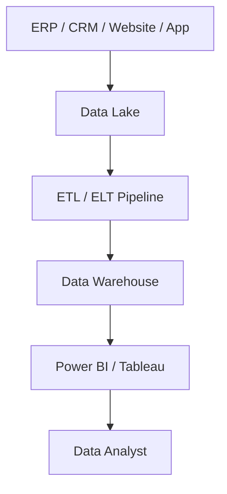
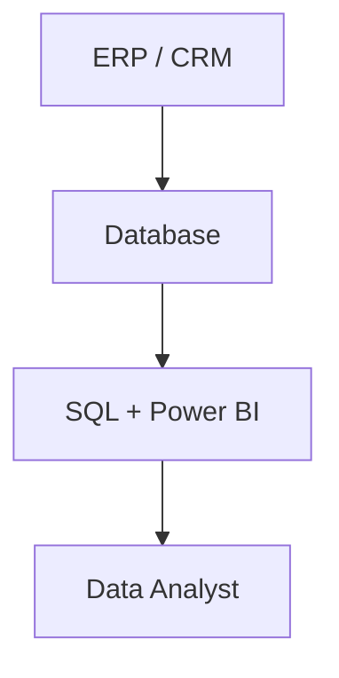
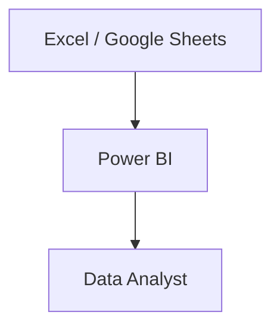

# Kiến trúc dữ liệu theo quy mô doanh nghiệp

```mermaid
flowchart TD
    A[ERP / CRM / Website / App]
    A --> B[Data Lake]
    B --> C[ETL / ELT Pipeline]
    C --> D[Data Warehouse]
    D --> E[Power BI / Tableau]
    E --> F[Data Analyst]
```

## Doanh nghiệp vừa

```mermaid
flowchart TD
    A[ERP / CRM]
    A --> B[Database]
    B --> C[SQL + Power BI]
    C --> D[Data Analyst]
```

## Doanh nghiệp nhỏ

```mermaid
flowchart TD
    A[Excel / Google Sheets]
    A --> B[Power BI]
    B --> C[Data Analyst]
```
